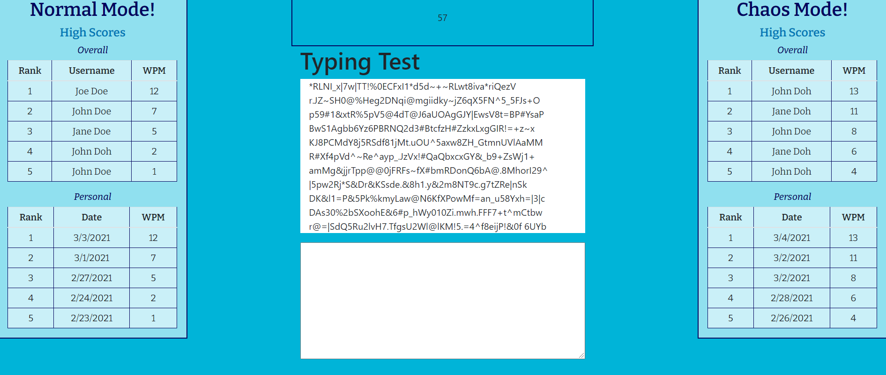

# Typing Test
A React App that lets you search through Google Books

* [Installation](#Installation)
    
* [Instructions](#Instructions)

* [Deployed Link](#Deployed-Link)
    
* [License](#License)
       
    ## Installation
    Make sure that you have Nodejs and mongoDB installed. Install packages with npm i. Create a .env and add a MONGODB_URI key that equals where you mongo database will be. Start the react app with the command: npm start 
    ## Instructions
    Login/create an account to get your personal scores saved. Choose a normal test or chaos mode test and type the prompt in the text box as fast as you can.
    ## Deployed Link
    https://typingcheck.herokuapp.com/

    ## License 
    This project is licensed under the MIT license
    - Israa Beseiso Brenda Goodwin Tim Holzer Isabel Toledo - GitHub Repo: https://github.com/IsraaBeseiso/TypeCheck